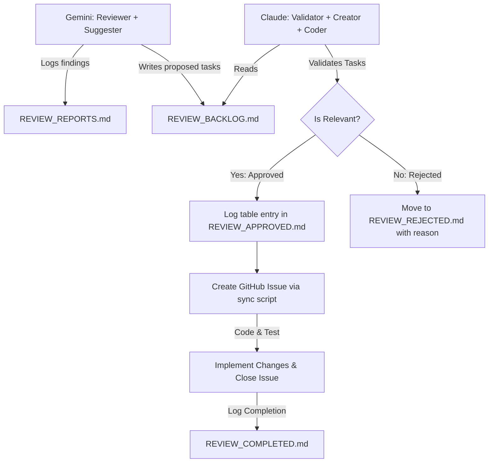

# GitHub Project Management & Backlog Workflow

This document defines the rules, board columns, labels, issue templates, and lifecycle transition rules for the Enterprise SIEM project management workflow. Both review agents (Gemini/Antigravity) and implementation agents (Claude/Codex) must strictly understand and follow these rules.

---

## 1. GitHub Project Board Columns
* **Inbox**: Initial entry point for new issues/ideas.
* **Triage**: Issues currently undergoing classification/investigation.
* **Approved Backlog**: Verified and approved tasks ready for assignment.
* **Assigned to Agent**: Tasks assigned to a specific AI agent or developer.
* **In Progress**: Active implementation phase.
* **Review**: Pull Requests or completed work awaiting validation.
* **Needs Fix**: Issues that failed testing/verification and need corrections.
* **Verification**: Final verification phase.
* **Done**: Completed tasks (code merged, tests passing, summary documented, no boundaries breached).
* **Not Backlog**: Items rejected or placed out of scope.

---

## 2. GitHub Issue Labels
Every issue must carry appropriate labels under the following dimensions:

### Agents
* `agent:gemini-review`: Assigned to Gemini/Antigravity for read-only audit.
* `agent:claude`: Assigned to Claude for implementation.
* `agent:codex`: Assigned to Codex for implementation.

### Issue Types
* `type:audit`: Code review, safety, or design auditing.
* `type:implementation`: Active feature development or bug-fixing code changes.
* `type:docs`: Documentation updates.
* `type:test`: Test case creation or refactoring.
* `type:infra`: Docker, container boundaries, or port exposures.
* `type:security`: Auth, tenancy, crypto, or RLS adjustments.
* `type:performance`: Indexing, caching, or latency optimizations.

### Functional Areas
* `area:tenant`: Tenant isolation, headers, database isolation.
* `area:dlq`: Dead Letter Queue pipelines and processing.
* `area:ingestion`: Telemetry gateway and event bus.
* `area:shadow`: Shadow-mode policies and advisory features.
* `area:auth`: API key validation, auth guards, internal tokens.
* `area:infra`: Docker-compose, networking boundaries, datastores.
* `area:ai-rag`: RAG knowledge-base seeding, vector store, guardrails.
* `area:docs`: Documentation files and readmes.

### Risk Dimensions (Severity)
* `risk:critical`: Production bypass, data breach, active auth bypass.
* `risk:high`: Privilege escalation, tenant leak, secret exposure.
* `risk:medium`: Reliability, performance, or conditional risks.
* `risk:low`: Doc drift, cleanups, naming, local-only bugs.
* `risk:none`: Positive validation or non-issue.

### Workflow Status
* `status:triage`: Awaiting assessment.
* `status:approved`: Approved for backlog.
* `status:blocked`: Blocked by dependency.
* `status:needs-human-decision`: Requires human decision on product policy.
* `status:not-backlog`: Rejected.

---

## 3. Collaborative Agent Workflow & Roles

This project uses a dual-agent collaborative workflow:



### A. Gemini / Antigravity (Reviewer & Suggester)
* **Role**: Technical auditing, safety checks, and architectural review.
* **Responsibilities**:
  1. Audit the system codebase, docker-compose setups, migrations, and test files.
  2. Document technical analysis of findings in [REVIEW_REPORTS.md](REVIEW_REPORTS.md) (in English).
  3. Write proposed backlog tasks to the bottom of [REVIEW_BACKLOG.md](REVIEW_BACKLOG.md) (in English) under the title `## Proposed Task: <title>`.
  4. **Do NOT** create issues on GitHub directly.

### B. Claude / Codex (Validator, Creator, and Implementer)
* **Role**: Local code engineering, task validation, GitHub issue lifecycle management, and implementation.
* **Responsibilities**:
  1. Read [REVIEW_BACKLOG.md](REVIEW_BACKLOG.md) to identify newly proposed tasks.
  2. Read [REVIEW_ALL.md](REVIEW_ALL.md) for full context on each finding.
  3. **Validate each task** — answer ALL of the following before deciding:
     - Is it architecturally relevant to the current scope? (no speculative redesign)
     - Does it violate any forbidden changes in `CLAUDE.md`?
     - Would it break existing tests (currently 3390 PHP green)?
     - Is the risk/benefit appropriate for academic scope?
     - Does it go in the right direction (shadow→active only after soak PASS)?
  4. **If Approved**:
     * Log the task under the `Approved Tasks` table in [REVIEW_APPROVED.md](REVIEW_APPROVED.md) (Task ID, description, file, priority).
     * Create a GitHub Issue via the sync script:
       ```powershell
       python scripts/sync_backlog.py --create "[BACKLOG-XXX] <title>" "<body>" "agent:claude,<labels>"
       ```
     * Implement the code — run targeted tests first, then full suite before commit.
     * Close the GitHub Issue with a summary comment:
       ```powershell
       python scripts/sync_backlog.py --close <issue_number> --comment "Implemented. Tests passed. Commit: <hash>."
       ```
     * Move the task details to [REVIEW_COMPLETED.md](REVIEW_COMPLETED.md) with commit hash.
     * Sync the local backlog file: `python scripts/sync_backlog.py --pull`
  5. **If Rejected**:
     * Move the task from `REVIEW_BACKLOG.md` to [REVIEW_REJECTED.md](REVIEW_REJECTED.md) with a clear reason (not relevant, breaks system, wrong direction, low priority for academic scope).

---

## 4. Issue Template: Claude/Codex Implementation
All implementation issues created on GitHub by Claude must follow this structure:

### Title Format
`[BACKLOG-XXX] <implementation title>`
*Example:* `[BACKLOG-IG-001] Implement IP-based rate limiting in ingestion-gateway`

### Body Format
```markdown
Source:
Link to proposed task or section in REVIEW_REPORTS.md.

Approved scope:
Files/areas allowed.

Forbidden:
Files/areas not allowed.

Acceptance criteria:
- behavior expected
- tests required
- docs required
- boundaries preserved

Validation:
- targeted tests during implementation
- full relevant suite only at final verification
```

---

## 5. Tracking Files Reference

| File | Owner | Purpose |
|---|---|---|
| `REVIEW_ALL.md` | Gemini | Full analysis: every finding with severity, evidence, category |
| `REVIEW_REPORTS.md` | Gemini | Detailed audit report (source of REVIEW_ALL.md entries) |
| `REVIEW_BACKLOG.md` | Gemini → Claude | Proposed tasks awaiting Claude's validation (synced from GitHub open issues via `sync_backlog.py --pull`) |
| `REVIEW_APPROVED.md` | Claude | Tasks validated and approved; each row has a GitHub Issue number |
| `REVIEW_REJECTED.md` | Claude | Tasks not immediately implemented — split into **Rejected / Deferred / Accepted Risk** with explicit reasons |
| `REVIEW_COMPLETED.md` | Claude | Tasks done: commit hash + GitHub Issue closed |

---

## 6. Finding Classification Rules

When a task is NOT approved for immediate implementation, Claude must classify it into one of three sections in `REVIEW_REJECTED.md`:

| Section | Classification | When to use |
|---|---|---|
| 1 | **Rejected** | False positive, not applicable, or implementation would introduce regression risk with zero functional or security benefit. Do NOT implement. |
| 2 | **Deferred** | Valid finding, but not in scope for the current phase. Document the production gate condition under which it must be revisited. |
| 3 | **Accepted Risk** | Valid finding intentionally tolerated for local/demo operational posture. Document the explicit risk and the condition under which it must be fixed. |

**Critical rule:** Enterprise-relevant reliability or production-hardening findings (concurrency, socket exhaustion, multi-tenant fairness, container resource limits) must **NEVER** be classified as Rejected merely because academic/demo RPS is currently low. Classify as Deferred with a production gate condition.

---

## 7. Transition Rules
* **Gemini Suggestion ≠ Backlog yet**: Audit findings are only suggestions. Gemini writes them to `REVIEW_BACKLOG.md` as `## Proposed Task:` entries. Claude must validate before anything is approved.
* **Claude Validation = GitHub Issue or Classification**: Claude is the gatekeeper. Only validated-and-approved tasks get a GitHub Issue. Non-approved tasks are classified as Rejected / Deferred / Accepted Risk in `REVIEW_REJECTED.md`.
* **Approved ≠ In Progress**: Approval and GitHub Issue creation happen first; implementation starts after.
* **Done = Commit + Tests + No Boundary Violation + Issue Closed**: An issue is marked closed on GitHub and moved to `REVIEW_COMPLETED.md` only when: code changes are committed, all relevant tests pass, and no architectural boundaries are violated.
* **One task per session step**: Do not batch-implement multiple tasks without running targeted tests after each.
* **Deferred ≠ Forgotten**: Before any production pilot, re-read all Deferred findings and evaluate which must be promoted to Backlog tasks.

