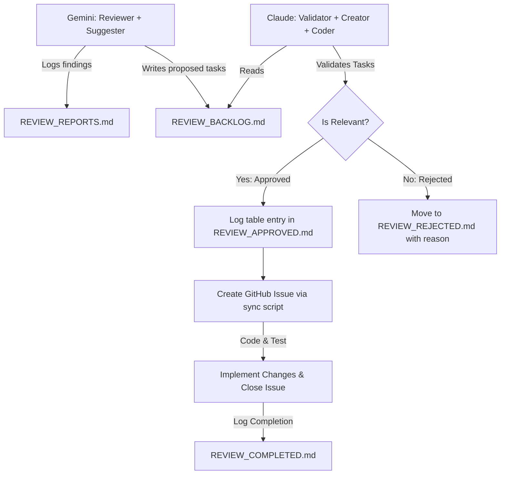

# GitHub Project Management & Backlog Workflow

This document defines the rules, board columns, labels, issue templates, and lifecycle transition rules for the Enterprise SIEM project management workflow. Both review agents (Gemini/Antigravity) and implementation agents (Claude/Codex) must strictly understand and follow these rules.

---

## 1. GitHub Project Board Columns
* **Inbox**: Initial entry point for new issues/ideas.
* **Triage**: Issues currently undergoing classification/investigation.
* **Approved Backlog**: Verified and approved tasks ready for assignment.
* **Assigned to Agent**: Tasks assigned to a specific AI agent or developer.
* **In Progress**: Active implementation phase.
* **Review**: Pull Requests or completed work awaiting validation.
* **Needs Fix**: Issues that failed testing/verification and need corrections.
* **Verification**: Final verification phase.
* **Done**: Completed tasks (code merged, tests passing, summary documented, no boundaries breached).
* **Not Backlog**: Items rejected or placed out of scope.

---

## 2. GitHub Issue Labels
Every issue must carry appropriate labels under the following dimensions:

### Agents
* `agent:gemini-review`: Assigned to Gemini/Antigravity for read-only audit.
* `agent:claude`: Assigned to Claude for implementation.
* `agent:codex`: Assigned to Codex for implementation.

### Issue Types
* `type:audit`: Code review, safety, or design auditing.
* `type:implementation`: Active feature development or bug-fixing code changes.
* `type:docs`: Documentation updates.
* `type:test`: Test case creation or refactoring.
* `type:infra`: Docker, container boundaries, or port exposures.
* `type:security`: Auth, tenancy, crypto, or RLS adjustments.
* `type:performance`: Indexing, caching, or latency optimizations.

### Functional Areas
* `area:tenant`: Tenant isolation, headers, database isolation.
* `area:dlq`: Dead Letter Queue pipelines and processing.
* `area:ingestion`: Telemetry gateway and event bus.
* `area:shadow`: Shadow-mode policies and advisory features.
* `area:auth`: API key validation, auth guards, internal tokens.
* `area:infra`: Docker-compose, networking boundaries, datastores.
* `area:ai-rag`: RAG knowledge-base seeding, vector store, guardrails.
* `area:docs`: Documentation files and readmes.

### Risk Dimensions (Severity)
* `risk:critical`: Production bypass, data breach, active auth bypass.
* `risk:high`: Privilege escalation, tenant leak, secret exposure.
* `risk:medium`: Reliability, performance, or conditional risks.
* `risk:low`: Doc drift, cleanups, naming, local-only bugs.
* `risk:none`: Positive validation or non-issue.

### Workflow Status
* `status:triage`: Awaiting assessment.
* `status:approved`: Approved for backlog.
* `status:blocked`: Blocked by dependency.
* `status:needs-human-decision`: Requires human decision on product policy.
* `status:not-backlog`: Rejected.

---

## 3. Collaborative Agent Workflow & Roles

This project uses a dual-agent collaborative workflow:



### A. Gemini / Antigravity (Reviewer & Suggester)
* **Role**: Technical auditing, safety checks, and architectural review.
* **Responsibilities**:
  1. Audit the system codebase, docker-compose setups, migrations, and test files.
  2. Document technical analysis of findings in [REVIEW_REPORTS.md](REVIEW_REPORTS.md) (in English).
  3. Write proposed backlog tasks to the bottom of [REVIEW_BACKLOG.md](REVIEW_BACKLOG.md) (in English) under the title `## Proposed Task: <title>`.
  4. **Do NOT** create issues on GitHub directly.

### B. Claude / Codex (Validator, Creator, and Implementer)
* **Role**: Local code engineering, task validation, GitHub issue lifecycle management, and implementation.
* **Responsibilities**:
  1. Read [REVIEW_BACKLOG.md](REVIEW_BACKLOG.md) to identify newly proposed tasks.
  2. Perform technical validation on each proposed task.
  3. **If Approved**:
     * Log the task under the `Approved Tasks` table in [REVIEW_APPROVED.md](REVIEW_APPROVED.md) using Task ID, Description, Primary File, and Priority.
     * Run the sync script to register the task as a GitHub Issue:
       ```powershell
       python scripts/sync_backlog.py --create "[BACKLOG-XXX] <title>" "<body>" "agent:claude,..."
       ```
     * Implement the code, run relevant tests to verify the behavior, and close the GitHub Issue:
       ```powershell
       python scripts/sync_backlog.py --close <issue_number> --comment "Implemented. Tests passed."
       ```
     * Move the task details from `REVIEW_BACKLOG.md` to [REVIEW_COMPLETED.md](REVIEW_COMPLETED.md).
  4. **If Rejected**:
     * Cut the task from `REVIEW_BACKLOG.md` and append it to [REVIEW_REJECTED.md](REVIEW_REJECTED.md) along with a clear reason explaining why it is not relevant or feasible.

---

## 4. Issue Template: Claude/Codex Implementation
All implementation issues created on GitHub by Claude must follow this structure:

### Title Format
`[BACKLOG-XXX] <implementation title>`
*Example:* `[BACKLOG-IG-001] Implement IP-based rate limiting in ingestion-gateway`

### Body Format
```markdown
Source:
Link to proposed task or section in REVIEW_REPORTS.md.

Approved scope:
Files/areas allowed.

Forbidden:
Files/areas not allowed.

Acceptance criteria:
- behavior expected
- tests required
- docs required
- boundaries preserved

Validation:
- targeted tests during implementation
- full relevant suite only at final verification
```

---

## 5. Transition Rules
* **Gemini Suggestion = Proposed Backlog**: Gemini's audit findings are only suggestions. They are written to `REVIEW_BACKLOG.md` as "Proposed Tasks".
* **Claude Validation = GitHub Issue or Rejection**: Claude acts as the gatekeeper. Rejections are documented in `REVIEW_REJECTED.md`. Approvals are created as GitHub Issues.
* **Done = Commit + Tests + Summary + No Boundary Violation**: An issue is marked closed on GitHub and moved to `REVIEW_COMPLETED.md` only after code changes pass verification without violating core SIEM platform boundaries.

