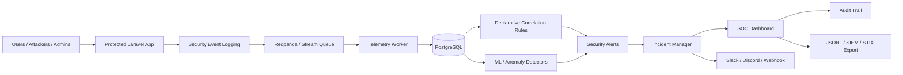

# Architecture Documentation

## System Architecture

The platform is a SOC-oriented detection engineering system. It receives telemetry from protected applications and infrastructure, normalizes events, stores them in PostgreSQL, runs correlation and ML/anomaly detectors, deduplicates alerts, groups alerts into incidents, and exposes analyst workflows through the SOC dashboard.

Exportable diagram:

```text
docs/architecture/system-architecture.mmd
```



## Telemetry Ingestion Flow

Raw telemetry from Sysmon, Zeek, Suricata EVE, Windows Security Events, Linux auth, and Linux auditd is normalized by adapters into the shared `telemetry_events` schema. Events can be written as JSONL or streamed through Redpanda/Kafka REST. The worker inserts events idempotently using `event_id`.

Diagram:

```text
docs/architecture/telemetry-ingestion-flow.mmd
```

## Correlation Pipeline

Detection is performed using a layered pipeline:

- sliding time windows
- declarative rule engine
- ML/anomaly detectors
- confidence scoring
- evidence chain generation
- alert deduplication
- incident correlation
- benchmarking and coverage validation

Diagram:

```text
docs/architecture/correlation-pipeline.mmd
```

## Incident Workflow

Incidents move through operational SOC states:

```text
open -> triaged -> investigating -> resolved
open/triaged/investigating -> false_positive
triaged -> escalated -> investigating
```

Diagram:

```text
docs/architecture/incident-workflow.mmd
```

## Notification Flow

Critical incidents and SLA breaches are routed through notification policy to Slack, Discord, or generic webhooks. Delivery attempts are written to `notification_delivery_logs` and surfaced through operational metrics.

Diagram:

```text
docs/architecture/notification-flow.mmd
```

## Deployment Topology

The production topology separates:

- Laravel app
- queue worker
- scheduler
- telemetry worker
- PostgreSQL
- Redpanda streaming layer
- reverse proxy/TLS boundary

Diagram:

```text
docs/architecture/deployment-topology.mmd
```

## Queue / Worker Flow

Queued jobs are stored in the database-backed `jobs` table. Workers reserve jobs, execute actions, retry failed work, and persist failed jobs for recovery.

Diagram:

```text
docs/architecture/queue-worker-flow.mmd
```

## SOC Dashboard Architecture

The SOC dashboard is protected by Laravel authentication and RBAC middleware. It reads incidents, alerts, telemetry, audit trails, and operational metrics through controller/API boundaries.

Diagram:

```text
docs/architecture/soc-dashboard-architecture.mmd
```

## Developer Notes

- Adapters are intentionally separated from the protected application source code.
- The normalized event contract is the integration boundary.
- Alert evidence should always include source events, entity context, MITRE mapping, confidence score, and rule metadata.
- Production readiness depends on queue worker health, scheduler heartbeat, ingestion lag, failed job count, and notification delivery status.

