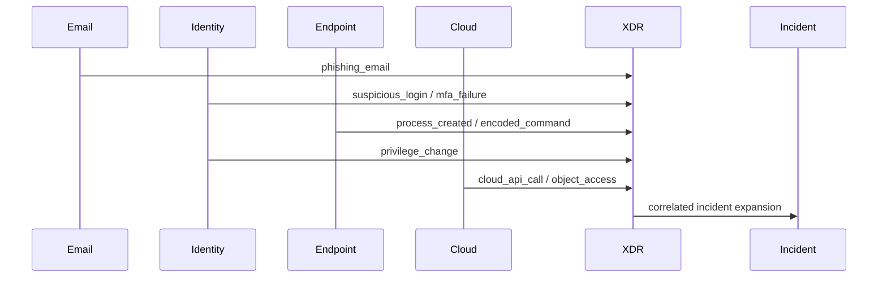
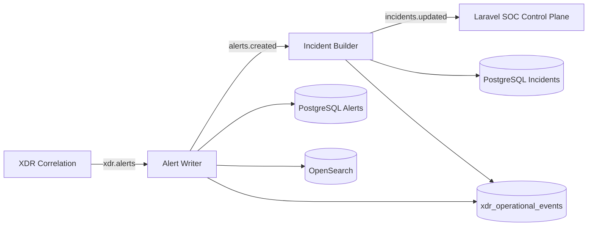
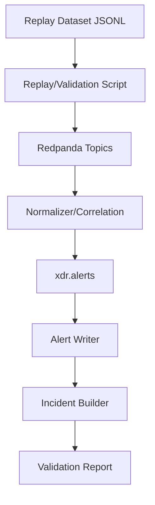
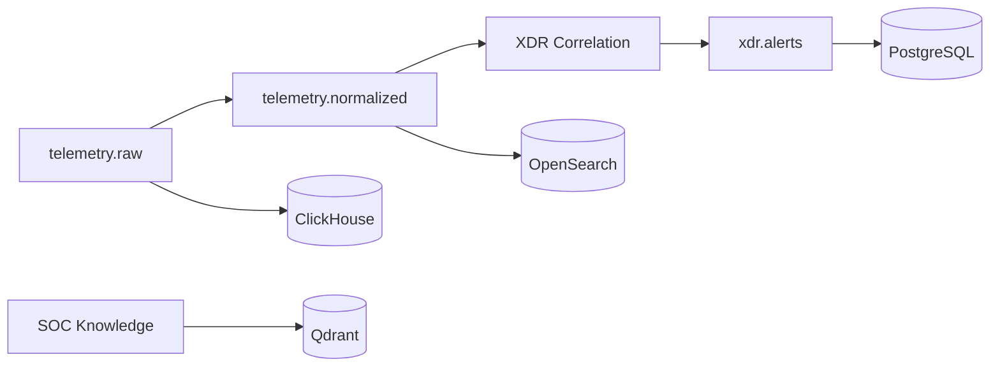
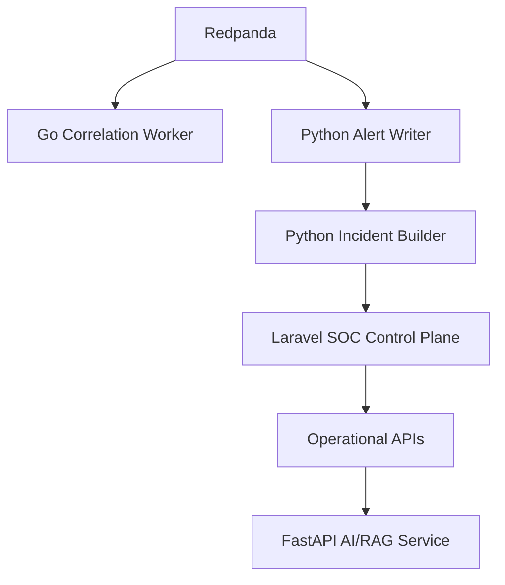
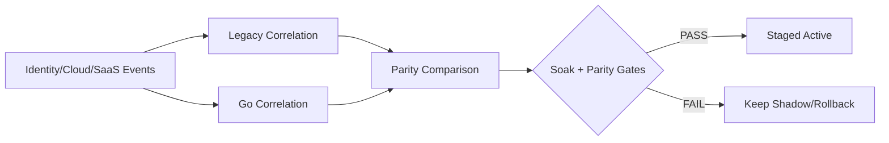
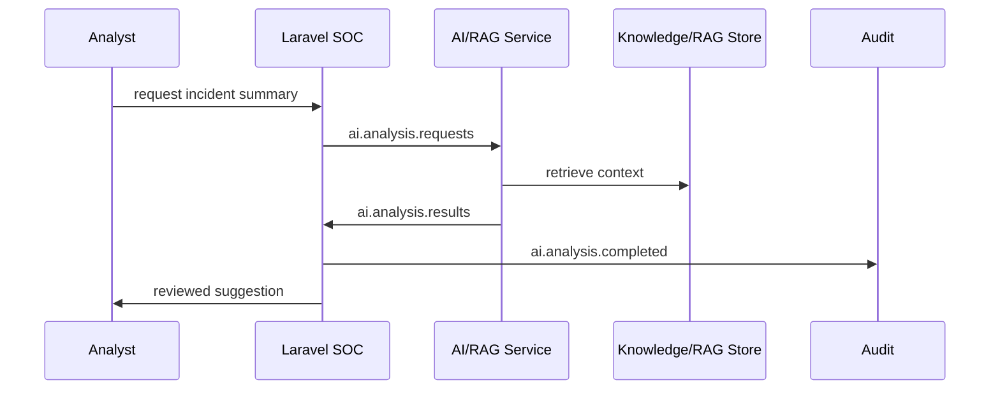

# XDR Validation Playbook

This document covers advanced XDR validation, attack simulation, operational testing, and replay-driven verification beyond basic web attacks.

Platform goal:

```text
A distributed, replay-validated, AI-assisted XDR-like prototype with event-driven architecture, operational validation tooling, and staged service migration.
```

Do not present this platform as:

- production hyperscale XDR
- full EDR
- offensive security tooling
- malware analysis framework
- kernel-level security platform

## 1. Scope Clarification

Current scope:

- distributed XDR-like platform
- telemetry normalization
- identity/cloud/SaaS correlation
- AI-assisted SOC workflow
- event-driven incident processing
- replayable operational validation
- staged service migration using strangler architecture

Not yet implemented:

- kernel-level EDR
- malware prevention
- live containment enforcement
- stealth/C2/persistence research
- production hyperscale guarantees
- real malware execution

Endpoint validation in this repo is telemetry-based detection and correlation validation. It is not kernel-level prevention.

## 2. Required Runtime

Start infrastructure:

```powershell
docker compose up -d
```

Start Laravel control plane:

```powershell
docker compose --profile app up -d --build
```

Start extracted XDR services:

```powershell
docker compose --profile strangler up -d --build
```

Prepare infrastructure:

```powershell
python scripts\xdr_setup_infra.py --output reports\xdr_infra_setup.json
php artisan xdr:storage-validate
```

Validate contracts:

```powershell
python scripts\xdr_contract_validate.py --output reports\xdr_contract_validation.json
```

Open SOC dashboard:

```text
http://127.0.0.1:8000/soc
```

## 3. Identity Attack Simulation

Identity-focused replay validates login, MFA, risky IP, privilege, and cross-service correlation.

### Scenarios

| Scenario | Expected Alert | Expected Severity | Correlation Entity |
| --- | --- | --- | --- |
| impossible travel | `IDENTITY_IMPOSSIBLE_TRAVEL` | high | user |
| MFA failure burst | `IDENTITY_MFA_FAILURE_BURST` | high | user |
| risky IP login | `IDENTITY_RISKY_IP_LOGIN` | high | user/source IP |
| unusual login source | `IDENTITY_UNUSUAL_LOGIN_SOURCE` | high | source IP |
| privilege escalation | `IDENTITY_PRIVILEGE_ESCALATION` | high | user |
| failed login across services | `IDENTITY_FAILED_LOGIN_ACROSS_SERVICES` | high | user/service |

### Example Replay Flow

Generate or use the realistic XDR dataset:

```powershell
python scripts\xdr_generate_realistic_dataset.py --events 52500 --output storage\logs\xdr_realistic_large.jsonl
```

Run identity/cloud/SaaS correlation benchmark:

```powershell
python scripts\xdr_correlation_shadow_benchmark.py --engine shadow --scope identity-cloud --dataset storage\logs\xdr_realistic_large.jsonl --output reports\xdr_identity_cloud_shadow.json
```

Run Go correlation staged smoke:

```powershell
php artisan xdr:correlation-cutover-status --engine=go --scope=identity-cloud --audit=0 --json
python scripts\xdr_correlation_soak.py --duration-minutes 5 --batch-size 5000 --sleep-ms 100 --output reports\xdr_identity_cloud_soak_smoke.json
```

### Expected Correlation Chain

```text
identity login event
  -> failed/risky/MFA/privilege event grouping
  -> Go/Python correlation
  -> xdr.alerts
  -> alert-writer-service
  -> alerts.created
  -> incident-builder-service
  -> incidents.updated
```

### Operational Validation Steps

```powershell
python scripts\xdr_contract_validate.py --output reports\xdr_contract_validation.json
python scripts\xdr_event_flow_resilience_validate.py --replays 3 --restart-services 0 --send-malformed 1 --output reports\xdr_event_flow_resilience_validation.json
php artisan xdr:correlation-cutover-status --engine=go --scope=identity-cloud --audit=0 --json
```

### Dashboard Validation

In `/soc`, verify:

- recent XDR alerts
- identity risk summary
- incident list updated
- affected user/entity visible
- MITRE overview updated if mapping exists
- operational panel shows correlation worker health

## 4. Cloud Attack Simulation

Cloud telemetry validation focuses on API activity, object access, access keys, policy modifications, and SaaS admin behavior.

### Scenarios

| Scenario | Telemetry Source | Expected Alert | Expected Severity |
| --- | --- | --- | --- |
| AWS access key creation | AWS CloudTrail style logs | `CLOUD_NEW_ACCESS_KEY` | high |
| suspicious object access | AWS/object storage audit | `CLOUD_SUSPICIOUS_OBJECT_ACCESS` | high |
| mass download behavior | cloud/SaaS audit logs | `CLOUD_MASS_DOWNLOAD` | high |
| security policy modification | cloud audit logs | `CLOUD_SECURITY_SETTING_MODIFIED` | high |
| unusual API activity | cloud API logs | `CLOUD_UNUSUAL_API_ACTIVITY` | high |
| SaaS admin activity | Google/M365/SaaS audit | `SAAS_UNUSUAL_ADMIN_ACTIVITY` | high |

### Replay Examples

Use AWS sample:

```powershell
python scripts\xdr_distributed_validate.py --input storage\logs\xdr_aws_sample.jsonl --output reports\xdr_cloud_validation.json
```

Use mixed realistic replay:

```powershell
python scripts\xdr_generate_realistic_dataset.py --events 52500 --output storage\logs\xdr_realistic_large.jsonl
python scripts\xdr_distributed_validate.py --input storage\logs\xdr_realistic_large.jsonl --output reports\xdr_distributed_validation.json
```

### Storage And Index Verification

```powershell
php artisan xdr:storage-validate
python scripts\xdr_setup_infra.py --output reports\xdr_infra_setup.json
```

Expected:

- ClickHouse healthy
- OpenSearch healthy
- Qdrant healthy
- Redpanda topic write/read healthy
- validation report shows insert/index/upsert/search success

## 5. Multi-Stage Attack Chain Validation

Example XDR chain:

```text
phishing email
  -> suspicious login
  -> endpoint execution
  -> privilege escalation
  -> cloud access
```

### Timeline Diagram



### Expected Incident Expansion

Incident should include:

- involved users
- involved hosts
- involved cloud accounts
- involved email artifacts
- external IPs/domains
- evidence timeline
- XDR kill-chain summary

### MITRE Mapping

Expected mapping examples:

| Chain Step | Example MITRE Area |
| --- | --- |
| phishing email | Initial Access |
| suspicious login | Credential Access / Initial Access |
| endpoint execution | Execution |
| privilege escalation | Privilege Escalation |
| cloud access | Collection / Exfiltration candidate |

### Replay/Reconstruction Validation

```powershell
python scripts\xdr_generate_realistic_dataset.py --events 52500 --output storage\logs\xdr_realistic_large.jsonl
php artisan xdr:attack-reconstruct --dataset=storage/logs/xdr_realistic_large.jsonl
```

If the command is not needed for a given demo, use the distributed validation report and incident detail page as evidence.

### AI/RAG Enrichment Behavior

Expected AI/RAG behavior:

- summarises incident from supplied evidence only
- cites evidence or knowledge base references
- suggests defensive investigation steps
- does not generate offensive instructions
- stores AI execution history and suggestion review state

Validate:

```powershell
curl http://127.0.0.1:8094/health
```

From the incident detail page, generate AI summary and verify:

- AI suggestion appears
- citations are present when retrieval context exists
- audit/history records the analyst action

## 6. Endpoint Telemetry Validation

Endpoint validation here means replaying or collecting telemetry. It does not execute malware and does not provide kernel-level EDR prevention.

Supported validation themes:

- PowerShell network activity
- encoded command execution
- suspicious process chains
- admin tool abuse
- unusual outbound connection
- file-change telemetry

### Safe Endpoint Telemetry Collection

Snapshot mode:

```powershell
python scripts\endpoint_telemetry_agent.py --output storage\logs\endpoint_snapshot.jsonl --host-id lab-host-1
```

Streaming/delta mode:

```powershell
python scripts\endpoint_telemetry_agent.py --stream --host-id lab-host-1 --watch-path storage\app --output storage\logs\endpoint_stream.jsonl
```

### Endpoint/DNS/Proxy Shadow Validation

```powershell
python scripts\xdr_endpoint_dns_proxy_shadow_prep.py --output reports\xdr_endpoint_dns_proxy_shadow_prep.json
```

Expected:

- `validation_status = SHADOW_PREP_READY`
- `cutover_allowed = false`
- no active mode enabled
- duplicate rate zero
- latency under 300ms

## 7. Distributed Operational Validation

### Redpanda

Check topics:

```powershell
python scripts\xdr_stream_bus.py topics
python scripts\xdr_stream_bus.py lag --topic xdr.alerts --consumer-group alert-writer-v1
```

Expected:

- topics exist
- lag is stable or low
- DLQ topic does not grow unexpectedly

### ClickHouse

```powershell
php artisan xdr:storage-validate
```

Expected:

- ClickHouse ping healthy
- raw telemetry insert/query validation passes

### OpenSearch

```powershell
php artisan xdr:storage-validate
```

Expected:

- index template valid
- indexing/search validation passes

### Qdrant

```powershell
php artisan xdr:storage-validate
```

Expected:

- collection exists or is created
- embedding upsert/search succeeds

### Replay Stability

```powershell
python scripts\xdr_distributed_validate.py --input storage\logs\xdr_m365_sample.jsonl --output reports\xdr_distributed_validation.json
```

PASS means:

- telemetry produced
- normalized
- stored
- searched
- correlated
- incident/AI path visible where applicable

### DLQ Validation

Use event-flow resilience validation:

```powershell
python scripts\xdr_event_flow_resilience_validate.py --replays 3 --restart-services 0 --send-malformed 1 --output reports\xdr_event_flow_resilience_validation.json
```

Expected:

- malformed event is accepted by stream or recorded as publish result
- service metrics show contract validation/DLQ behavior
- event store remains idempotent

### Service Restart/Recovery

```powershell
python scripts\xdr_event_flow_resilience_validate.py --replays 2 --restart-services 1 --send-malformed 1 --output reports\xdr_event_flow_resilience_restart_validation.json
```

Expected:

- event store not duplicated
- no data loss for replayed event
- restart action succeeds when Docker API is available

If Docker API is blocked, run restart manually:

```powershell
docker compose restart alert-writer-service
docker compose restart incident-builder-service
```

## 8. Event-Driven Architecture Validation

### Topics

| Topic/Event | Purpose |
| --- | --- |
| `xdr.alerts` | correlation output |
| `alerts.created` | alert writer output after persistence |
| `incidents.updated` | incident builder output |
| `ai.analysis.completed` | AI workflow completion event |

### Event Contract v1

All operational events use:

```json
{
  "event_id": "evt-...",
  "event_type": "alert.created",
  "schema_version": 1,
  "occurred_at": "2026-05-13T00:00:00Z",
  "trace_id": "trace-...",
  "source_service": "alert-writer-service",
  "payload": {},
  "metadata": {}
}
```

### Idempotency Behavior

Replay should not duplicate `xdr_operational_events`.

Aggregate event IDs are derived from:

```text
event_type + aggregate_type + aggregate_id + trace_id
```

Validation:

```powershell
php artisan xdr:event-store-count --event-type=alert.created --json
python scripts\xdr_event_flow_resilience_validate.py --replays 3 --restart-services 0 --send-malformed 1 --output reports\xdr_event_flow_resilience_validation.json
```

## 9. Validation Matrix

| Validation Scenario | Telemetry Source | Expected Alert | Expected Correlation | Expected Incident Behavior | Expected Operational Metric |
| --- | --- | --- | --- | --- | --- |
| impossible travel | identity sign-in | `IDENTITY_IMPOSSIBLE_TRAVEL` | user + source IP sequence | incident includes user and login evidence | p95 < 300ms |
| MFA failure burst | identity/MFA logs | `IDENTITY_MFA_FAILURE_BURST` | user/time-window grouping | incident timeline shows MFA failures | fallback 0 |
| risky IP login | identity risk logs | `IDENTITY_RISKY_IP_LOGIN` | user + risky IP | alert linked to identity incident | duplicate rate 0 |
| privilege escalation | identity/cloud audit | `IDENTITY_PRIVILEGE_ESCALATION` | role/admin action | incident severity high | evidence match >= 0.98 |
| AWS access key creation | CloudTrail | `CLOUD_NEW_ACCESS_KEY` | cloud account + user | cloud account added to entities | storage validation PASS |
| mass download | cloud/SaaS logs | `CLOUD_MASS_DOWNLOAD` | repeated download action | incident expands timeline | stream lag stable |
| phishing to endpoint | email + identity + endpoint | `XDR_PHISHING_TO_ENDPOINT_EXECUTION` | cross-domain chain | incident kill-chain summary | AI summary available |
| IOC DNS endpoint chain | DNS + endpoint | `XDR_IOC_DNS_ENDPOINT_CHAIN` | domain + host | endpoint evidence linked | shadow-only report ready |
| proxy endpoint escalation | proxy + endpoint | `XDR_PROXY_ENDPOINT_ESCALATION` | host + proxy domain | incident candidate | no active cutover |
| malformed event | stream input | DLQ/contract failure | no valid correlation | no duplicate event-store row | DLQ/contract metric increments |

## 10. Architecture Diagrams

### Event-Driven Flow



### Replay Validation Flow



### Distributed Pipeline



### Strangler Migration



### Identity/Cloud Staged Cutover



### AI/RAG Request Flow



## 11. PASS/FAIL Interpretation

PASS:

- validation report says `PASS`
- no fallback
- no request failures
- p95 below target
- event store idempotent
- DLQ behavior observed for malformed events
- dashboard shows incidents/alerts/metrics

FAIL:

- fallback count above 0
- request failures above 0
- p95 above 300ms under sustained load
- duplicate event-store rows
- stream lag keeps growing
- storage validation fails
- incident is not expanded from correlated alerts

If a gate fails, keep the system in `shadow` or rollback to `legacy`. Do not make Go correlation default.
