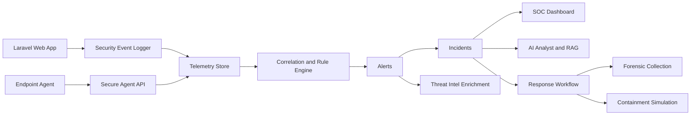
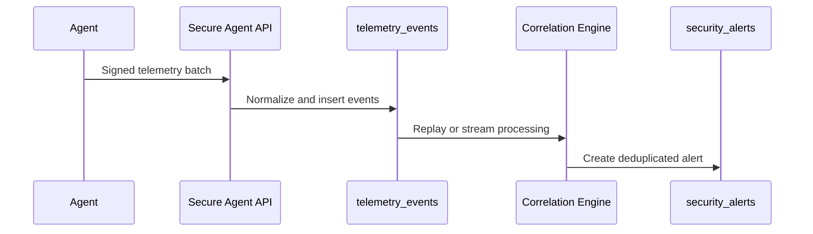
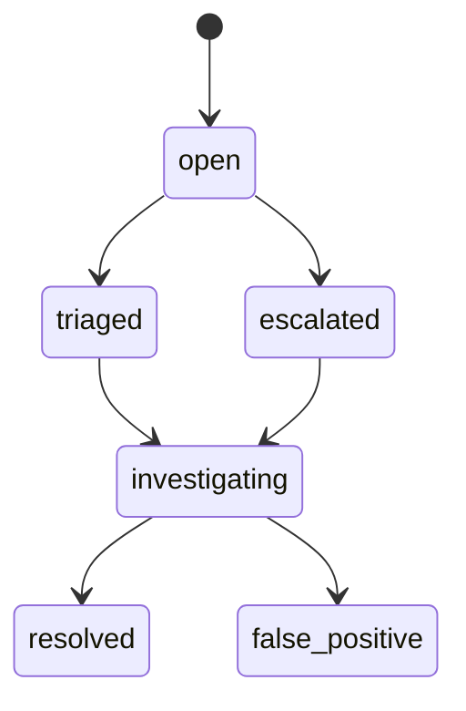
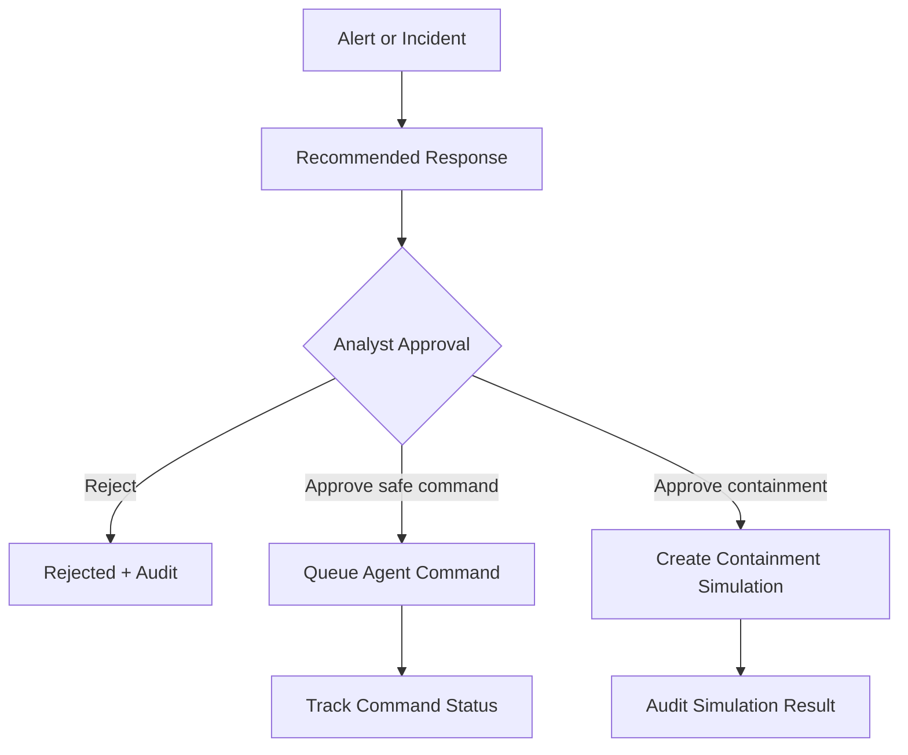
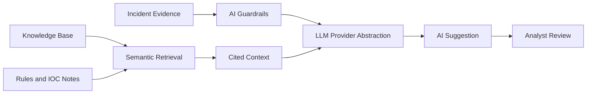
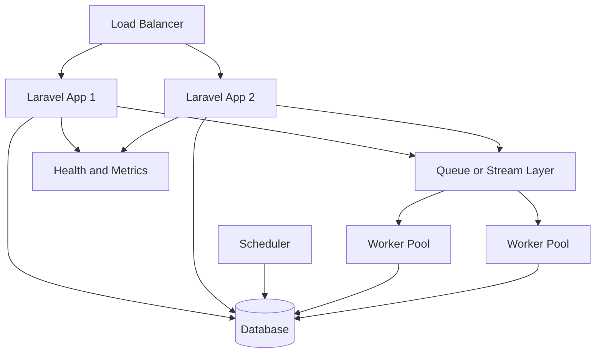

# Architecture Summary

## High-Level Platform

## Telemetry Ingestion Flow

## Incident Workflow

## Response and Containment Simulation

## AI and Knowledge Retrieval

## Deployment Topology

## Developer Notes

- Keep detection logic declarative where possible.
- Keep containment actions simulation-only unless production integrations are explicitly designed.
- Use audit logging for analyst actions, AI output review, workflow changes, and response approvals.
- Use enterprise validation commands before deployment and after configuration changes.
