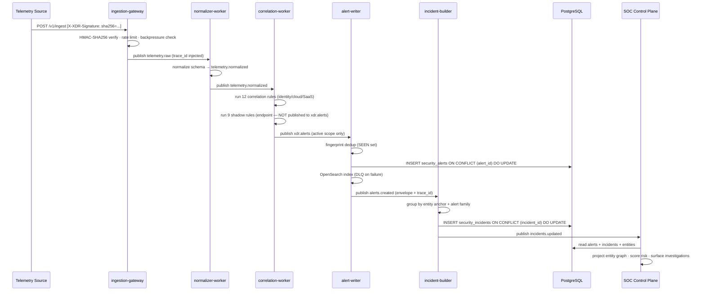
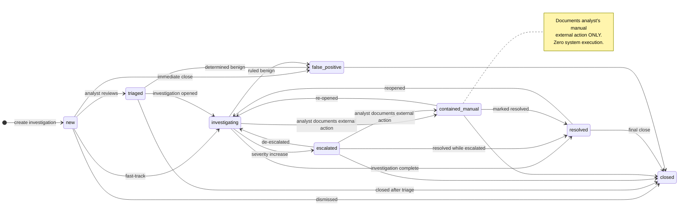

# Architecture and Flow Diagrams

Last updated: 2026-05-17

All diagrams use Mermaid syntax — render in GitHub, GitLab, Notion, or any Mermaid-compatible viewer.

---

## 1. Final System Architecture

```mermaid
flowchart TB
    subgraph Sources["Telemetry Sources"]
        WA[Web Application<br/>HTTP telemetry]
        EA[Endpoint Agent<br/>Linux /proc collector]
    end

    subgraph Pipeline["Event Pipeline — Go Services"]
        IG[ingestion-gateway<br/>HMAC-SHA256 auth<br/>Rate limiting · Backpressure]
        NW[normalizer-worker<br/>Schema normalization<br/>endpoint-v1 format]
        CW[correlation-worker<br/>12 active rules<br/>identity/cloud/SaaS<br/>9 shadow rules · endpoint]
    end

    subgraph Stream["Redpanda — Event Streaming"]
        TR[(telemetry.raw)]
        TN[(telemetry.normalized)]
        XA[(xdr.alerts)]
        XS[(xdr.alerts.shadow.endpoint)]
        AC[(alerts.created)]
        IU[(incidents.updated)]
    end

    subgraph Writers["Event Writers — Python Services"]
        AW[alert-writer-service<br/>PostgreSQL persistence<br/>OpenSearch indexing<br/>trace_id propagation]
        IB[incident-builder-service<br/>Deterministic grouping<br/>ON CONFLICT upsert]
        AI[ai-rag-service<br/>Heuristic + ML assist<br/>Qdrant vector store]
    end

    subgraph Storage["Storage"]
        PG[(PostgreSQL<br/>SOC state · alerts<br/>incidents · workflow)]
        OS[(OpenSearch<br/>Alert indexing)]
        CH[(ClickHouse<br/>Analytics sync)]
        QD[(Qdrant<br/>Vector store)]
    end

    subgraph Laravel["Laravel SOC Control Plane"]
        Dashboard[SOC Dashboard]
        Invest[Investigation Workflow]
        Entity[Entity Graph · Risk]
        Response[Response Planning<br/>advisory-only]
        Export[Export Center]
        Secure[Security Hardening]
        Resilience[Resilience Validation]
    end

    WA -->|signed batch| IG
    EA -->|signed batch| IG
    IG --> TR
    TR --> NW
    NW --> TN
    TN --> CW
    CW -->|active domains| XA
    CW -->|shadow only| XS
    XA --> AW
    AW --> PG
    AW --> OS
    AW --> AC
    AC --> IB
    IB --> PG
    IB --> IU
    PG --> Laravel
    AI -.->|analyst assist| Laravel

    style XS fill:#2d3748,stroke:#e53e3e,stroke-dasharray:5 5
    style Sources fill:#1a202c
    style Pipeline fill:#1a202c
    style Writers fill:#1a202c
    style Storage fill:#1a202c
    style Laravel fill:#1a202c
```

---

## 2. Event Flow — Telemetry to Incident

---

## 3. Detection Flow — Rule-Based Correlation

```mermaid
flowchart LR
    subgraph Input["Normalized Event"]
        E[event_type<br/>telemetry_type<br/>user / source_ip<br/>action · risk_score<br/>trace_id]
    end

    subgraph CorrelationEngine["Correlation Worker — Rule Engine"]
        direction TB
        GK[Group by actor_key<br/>sliding window]

        subgraph ActiveRules["Active Rules — identity/cloud/SaaS"]
            R1[IDENTITY_MFA_FAILURE_BURST<br/>failed_logins ≥ 5 in window]
            R2[CLOUD_SUSPICIOUS_OBJECT_ACCESS<br/>cloud_objectAccess ≥ 5]
            R3[... 10 more active rules ...]
        end

        subgraph ShadowRules["Shadow Rules — endpoint / threat-intel"]
            S1[SCHEDULED_TASK_PERSISTENCE<br/>shadow topic only]
            S2[C2_BEACON_PATTERN<br/>shadow topic only]
            S3[... 9 + 3 shadow rules ...]
        end

        GK --> ActiveRules
        GK --> ShadowRules
    end

    subgraph Output["Alert Output"]
        XA[xdr.alerts<br/>→ persisted to security_alerts]
        XS[xdr.alerts.shadow.endpoint<br/>NOT consumed by alert-writer<br/>shadow observation only]
    end

    E --> GK
    ActiveRules -->|alert generated| XA
    ShadowRules -->|shadow observation| XS

    style XS fill:#2d3748,stroke:#e53e3e,stroke-dasharray:5 5
    style ShadowRules fill:#2d3748
```

---

## 4. Investigation Workflow — State Machine

---

## 5. Replay-Safe Validation — Event Store Idempotency

```mermaid
flowchart TD
    subgraph Producer["Event Producer"]
        P[alert-writer-service<br/>or incident-builder-service]
    end

    subgraph EventStore["xdr_operational_events — Replay-Safe Store"]
        direction TB
        INS["INSERT INTO xdr_operational_events<br/>(event_id, event_type, payload, trace_id, ...)<br/>ON CONFLICT (event_id) DO NOTHING"]
        IDEM{event_id<br/>already exists?}
        STORE[(Store event<br/>row count = 1)]
        SKIP[Silently skip<br/>no error · no duplicate]
    end

    subgraph Replay["Replay Scenario"]
        R1[Same event_id replayed<br/>after restart or degraded state]
        R2[insertOrIgnore → still 1 record]
    end

    P -->|envelope with event_id| INS
    INS --> IDEM
    IDEM -- No --> STORE
    IDEM -- Yes --> SKIP

    R1 --> INS
    R2 -.->|verified by ResilienceValidationService| STORE

    style STORE fill:#2d4a2d,stroke:#48bb78
    style SKIP fill:#2d3748,stroke:#718096
```

---

## 6. Shadow-Only Boundary — Endpoint Isolation

```mermaid
flowchart TB
    subgraph ActiveDomains["Active Domains — Persisted to SOC"]
        IA[Identity events<br/>login · MFA · session]
        CA[Cloud/SaaS events<br/>object access · admin actions]
    end

    subgraph ShadowDomains["Shadow-Only Domains — NOT Persisted"]
        EP[Endpoint events<br/>process · network · file]
        DNS[DNS / Proxy events]
        FW[Firewall events]
        TI[Threat-Intel IOC matches]
    end

    subgraph CorrelationWorker["Correlation Worker"]
        AC[Active correlation<br/>12 rules]
        SC[Shadow correlation<br/>9 behavioral + 3 IOC rules]
    end

    subgraph Topics["Redpanda Topics"]
        XA[xdr.alerts<br/>← CONSUMED by alert-writer]
        XS[xdr.alerts.shadow.endpoint<br/>← NOT consumed · observation only]
    end

    subgraph SOC["SOC State"]
        SA[(security_alerts<br/>active alerts only)]
        UI[/entity-risk UI<br/>advisory shadow indicators/]
    end

    IA --> AC
    CA --> AC
    EP --> SC
    DNS --> SC
    FW --> SC
    TI --> SC

    AC -->|generates alert| XA
    SC -->|generates observation| XS

    XA -->|persisted| SA
    XS -.->|advisory only| UI
    SA --> SOC

    style XS fill:#2d3748,stroke:#e53e3e,stroke-dasharray:5 5
    style ShadowDomains fill:#2d3748
    style SC fill:#2d3748
    style UI fill:#2d4a2d,stroke:#68d391
```

---

## 7. Response Planning Flow — Advisory-Only

```mermaid
flowchart TD
    subgraph Trigger["Trigger"]
        ER[High-risk entity<br/>from EntityRiskScoringService]
    end

    subgraph Generation["Recommendation Generation<br/>(deterministic, no LLM)"]
        RG[ResponsePlanningService<br/>generateRecommendationsForEntity]
        R1["user + critical + MFA burst<br/>→ recommend_reset_password"]
        R2["host + persistence_indicator<br/>→ recommend_collect_forensics<br/>(advisory_only=true)"]
        R3["ip + risk ≥ high<br/>→ recommend_block_ip"]
        RG --> R1
        RG --> R2
        RG --> R3
    end

    subgraph Workflow["Approval Workflow"]
        direction TB
        D[draft] -->|analyst submits| PA[pending_approval]
        PA -->|reviewer approves| AP[approved]
        PA -->|reviewer rejects| RJ[rejected]
        RJ -->|analyst revises| D
        AP -->|analyst documents completion| CD[completed_documented]
        AP --> CA[cancelled]
        D --> CA
        PA --> CA
    end

    subgraph Constraint["Hard Constraint"]
        C1[❌ No execute_* columns<br/>❌ No network calls<br/>❌ No process management<br/>❌ No DB side effects from approval]
        C2[✓ completed_documented = analyst<br/>manually confirmed external action<br/>ZERO system execution]
    end

    ER --> RG
    Generation --> Workflow
    Workflow -.-> Constraint

    style CD fill:#2d4a2d,stroke:#48bb78
    style Constraint fill:#2d3748
```

---

## 8. Entity Graph — Projection and Pivoting

```mermaid
flowchart LR
    subgraph Sources["Authoritative Sources"]
        SA[(security_alerts)]
        SI[(security_incidents)]
        OE[(xdr_operational_events)]
    end

    subgraph Projection["EntityGraphService — Projection Layer"]
        UE[upsertEntity<br/>firstOrCreate + increment<br/>observation_count]
        UR[upsertRelationship<br/>dedup + increment]
        AO[appendObservation<br/>ALWAYS INSERT · append-only]
        PF[projectFromAlerts<br/>read-only scan · limit 500]
    end

    subgraph EntityStore["Entity Store"]
        EN[(entities<br/>type · key · risk_score<br/>risk_level · risk_factors)]
        RL[(entity_relationships<br/>source → target · type · confidence)]
        OB[(entity_observations<br/>append-only event log)]
        RS[(entity_risk_snapshots<br/>risk calculation history)]
    end

    subgraph UI["Investigation UI"]
        Search[/entity — search + list/]
        Timeline[/entity/id/timeline — sorted events/]
        Graph[/entity/id/graph — adjacency d=1/]
        Risk[/entity-risk — risk dashboard/]
    end

    SA --> PF
    SI --> PF
    OE --> PF
    PF --> UE
    PF --> UR
    PF --> AO
    UE --> EN
    UR --> RL
    AO --> OB
    EN --> RS
    EN --> UI
    RL --> UI
    OB --> Timeline

    style OB fill:#2d4a2d,stroke:#48bb78
    style Sources fill:#1a202c
```

