# Polyglot Microservices XDR Architecture

This platform now uses a polyglot microservices layout while keeping Laravel as the SOC control plane.

## Service Map

| Service | Runtime | Port | Responsibility | Input | Output |
| --- | --- | ---: | --- | --- | --- |
| `soc-control-plane` | PHP/Laravel | `8000` | Auth, RBAC, SOC dashboard, incidents, workflow, audit, reports | `alerts.created`, `incidents.updated`, `ai.analysis.results` | `ai.analysis.requests` |
| `ingestion-gateway` | Go | `8091` | Signed telemetry ingestion, rate limiting, backpressure admission, raw publish | HTTP `/v1/ingest` | `telemetry.raw` |
| `normalizer-worker` | Go | `8092` | Consume raw telemetry, normalize schema, publish normalized events, DLQ malformed events | `telemetry.raw` | `telemetry.normalized`, `telemetry.normalized.dlq` |
| `correlation-worker` | Go | `8093` | Shadow/staged identity-cloud-SaaS correlation, publish XDR alerts | `telemetry.normalized` | `xdr.alerts`, `xdr.alerts.dlq` |
| `alert-writer-service` | Python/FastAPI | `8095` | Consume XDR alerts, write PostgreSQL/OpenSearch, emit idempotent alert-created events | `xdr.alerts` | `alerts.created`, `xdr.alerts.dlq` |
| `incident-builder-service` | Python/FastAPI | `8096` | Build/update incidents from created alerts | `alerts.created` | `incidents.updated`, `incidents.builder.dlq` |
| `ai-rag-service` | Python/FastAPI | `8094` | Defensive AI analysis, retrieval, embeddings, heuristic fallback | `ai.analysis.requests` or HTTP | `ai.analysis.results`, `ai.analysis.completed` |

## Event Flow

```mermaid
flowchart LR
    Source[Telemetry Sources] --> Gateway[Go ingestion-gateway]
    Gateway --> Raw[(Redpanda telemetry.raw)]
    Raw --> Normalizer[Go normalizer-worker]
    Normalizer --> Normalized[(Redpanda telemetry.normalized)]
    Normalized --> Correlation[Go correlation-worker]
    Correlation --> Alerts[(Redpanda xdr.alerts)]
    Alerts --> Writer[Python alert-writer-service]
    Writer --> Created[(Redpanda alerts.created)]
    Created --> Builder[Python incident-builder-service]
    Builder --> Updated[(Redpanda incidents.updated)]
    Updated --> Laravel[Laravel SOC control-plane]
    Laravel --> AIReq[(ai.analysis.requests)]
    AIReq --> AI[Python ai-rag-service]
    AI --> AIResult[(ai.analysis.results)]
    AIResult --> Laravel
```



## Storage Responsibilities

| Storage | Responsibility |
| --- | --- |
| PostgreSQL | SOC state, RBAC, workflow, incidents, audit, operational event store |
| ClickHouse | Raw/normalized telemetry and replay/throughput metrics |
| OpenSearch | Searchable telemetry, alerts, incidents, IOC/hunt search |
| Qdrant | SOC knowledge, incident, IOC, and analyst-note vectors |
| Redpanda | Streaming backbone and replayable event topics |

## Runtime Commands

Start infrastructure and extracted services:

```powershell
docker compose --profile strangler up -d --build
python scripts\xdr_setup_infra.py --output reports\xdr_infra_setup_polyglot.json
php artisan migrate --seed
```

Optional Laravel app container:

```powershell
docker compose --profile app up -d --build app queue scheduler
```

Local Laravel app mode:

```powershell
php artisan serve --host=127.0.0.1 --port=8000
```

Validate the polyglot runtime:

```powershell
python scripts\xdr_polyglot_microservices_validate.py --output reports\xdr_polyglot_microservices_validation.json
```

When all six first-party services require mutual TLS, provide HTTPS URLs and a
dedicated internal client identity:

```powershell
python scripts\xdr_polyglot_microservices_validate.py --gateway-url https://ingestion-gateway:8091 --normalizer-url https://normalizer-worker:8092 --correlation-url https://correlation-worker:8093 --ai-url https://ai-rag-service:8094 --alert-writer-url https://alert-writer-service:8095 --incident-builder-url https://incident-builder-service:8096 --internal-mtls-enabled --internal-mtls-ca storage/certs/internal-mtls/ca.crt --internal-mtls-client-cert storage/certs/internal-mtls/client.crt --internal-mtls-client-key storage/certs/internal-mtls/client.key --output reports/xdr_polyglot_microservices_validation.json
```

The internal identity is used only for first-party health, signed ingestion,
and metrics requests. Redpanda, ClickHouse, OpenSearch, and Qdrant retain their
own transport configuration; the Qdrant CA context is not replaced or reused.

## Health Endpoints

| Service | Health | Metrics |
| --- | --- | --- |
| ingestion-gateway | `http://127.0.0.1:8091/health` | `http://127.0.0.1:8091/metrics` |
| normalizer-worker | `http://127.0.0.1:8092/health` | `http://127.0.0.1:8092/metrics` |
| correlation-worker | `http://127.0.0.1:8093/health` | `http://127.0.0.1:8093/metrics` |
| ai-rag-service | `http://127.0.0.1:8094/health` | `http://127.0.0.1:8094/metrics` |
| alert-writer-service | `http://127.0.0.1:8095/health` | `http://127.0.0.1:8095/metrics` |
| incident-builder-service | `http://127.0.0.1:8096/health` | `http://127.0.0.1:8096/metrics` |

## Operational Rules

- Laravel remains the control plane, not the hot-path streaming processor.
- The active Go correlation scope remains `identity-cloud` until soak gates pass.
- Endpoint/DNS/proxy correlation remains shadow-only until separate parity and latency gates pass.
- All cross-service events must keep `schema_version`, `trace_id`, source service, and idempotent aggregate IDs.
- DLQ topics are operational signals, not normal success paths.

## Cutover Boundary

The current safe polyglot boundary is:

```text
HTTP telemetry -> Go ingestion -> Redpanda -> Go normalization -> Redpanda
-> Go identity/cloud/SaaS correlation -> Redpanda -> Python alert writer
-> Redpanda -> Python incident builder -> Laravel SOC visibility
```

Do not migrate broader endpoint/DNS/proxy correlation into active mode until the same golden-test, large-replay, parity, soak, and rollback gates are satisfied.
